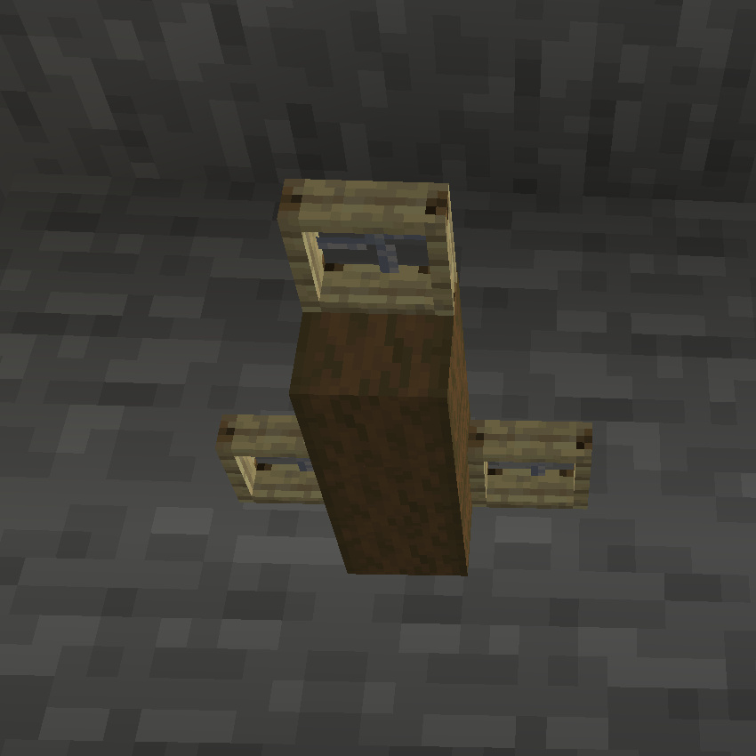
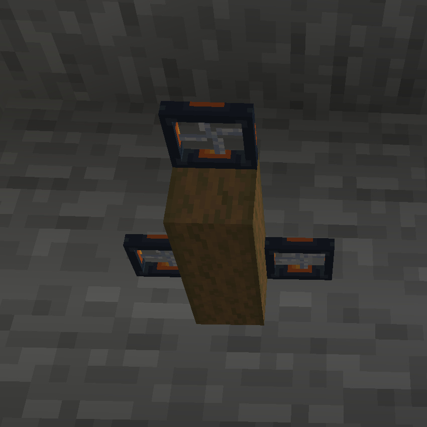
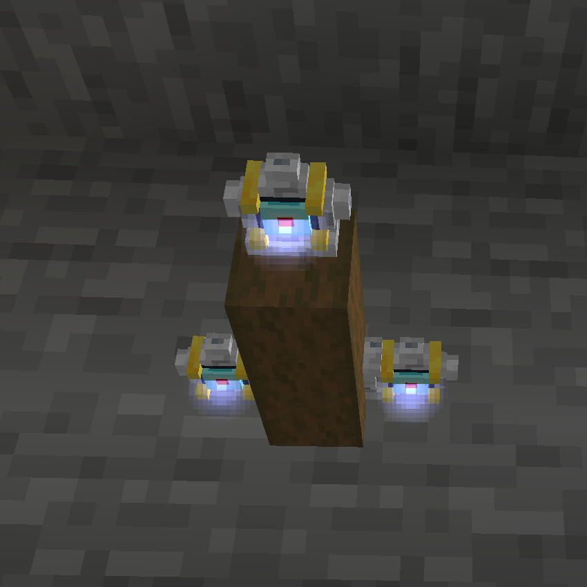
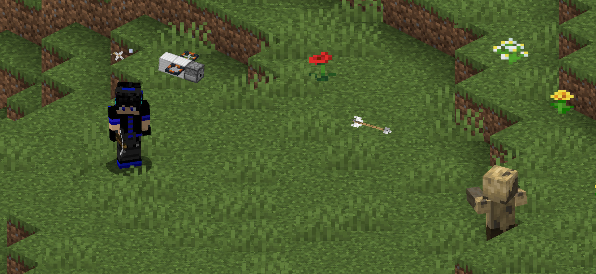
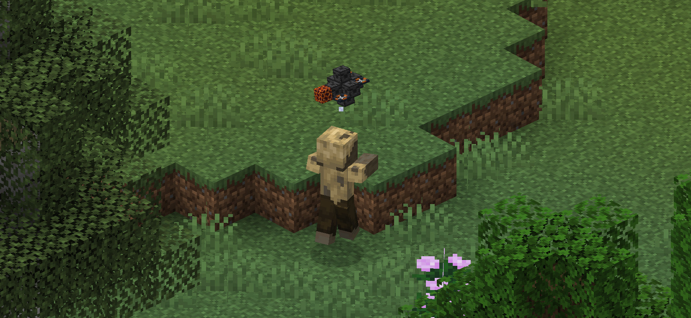
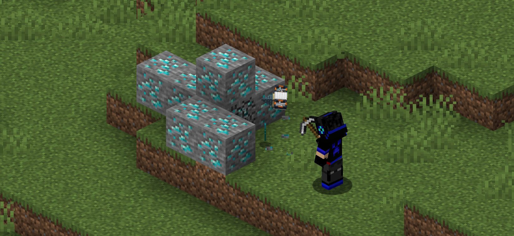
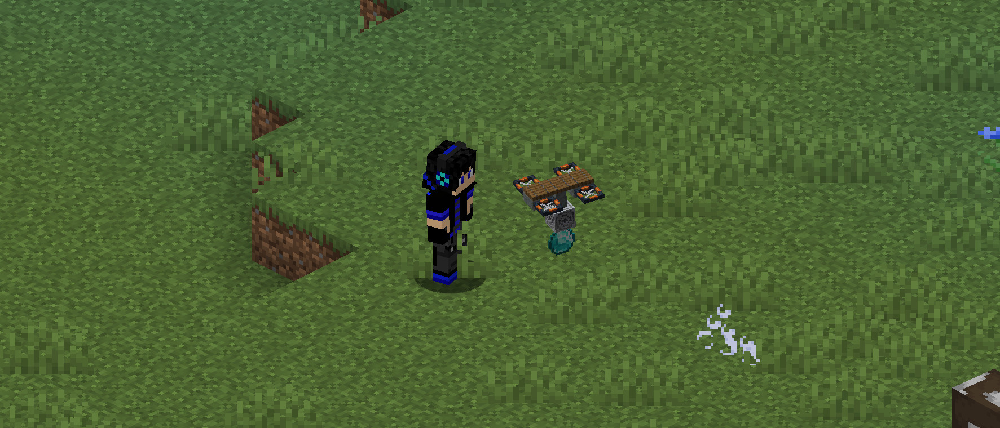
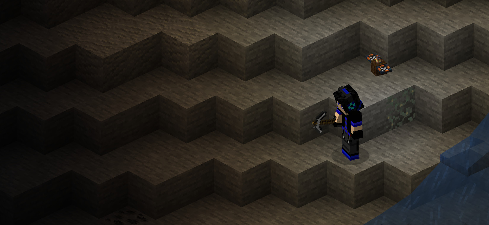
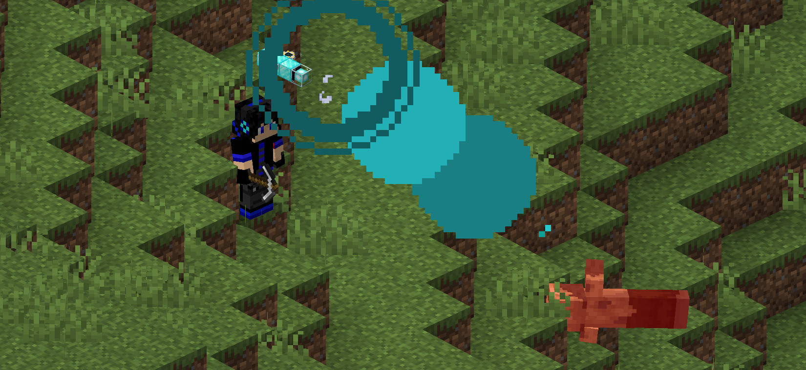

[← Back to home](index.html)

# Abilities Reference

A drone's abilities are determined entirely by the blocks it's built from, and in some cases where those blocks are
placed. "Front" refers to the side of the drone that faced you when you placed the Drone Assembly Controller it was
built on.

## Flight (Rotors)

**Blocks:** Wooden Rotor, Advanced Rotor, or Ion Thruster

**Placement:** Each rotor needs two empty blocks directly beneath it to provide thrust. Rotors can otherwise be placed
anywhere on the drone.

Every drone needs at least one rotor to fly. The three tiers provide increasing amounts of thrust — Wooden Rotors are
the weakest and cheapest, Advanced Rotors are a solid mid-tier upgrade, and Ion Thrusters provide the most power. Bigger/heavier drones need more or stronger rotors to stay nimble.

<table><tr>
<td></td>
<td></td>
<td></td>
</tr></table>

## Arrow Launcher

**Block:** Dispenser

**Placement:** On the front of the drone, with a clear line of sight forward (don't build other blocks in front of it).

Automatically fires arrows at hostile enemies within range, without consuming any arrows. This is always active once
the drone has line of sight to a target.

## Melee Attack

**Block:** Cactus or Magma Block

**Placement:** On the front of the drone, with a clear line of sight forward.

The drone will fly toward nearby hostile enemies (or enemies the player has recently attacked) and attack them on
contact using the damaging block.

## Mining Support

**Block:** Drill

**Placement:** On the front of the drone, with a clear line of sight forward.

While the player is breaking a block, a drone with this ability will fly over and help break the same block, speeding
up mining. The drone needs to stay reasonably close to the player to assist.

## Item Pickup

**Block:** Lodestone

**Placement:** On the bottom of the drone, with a clear line of sight downward (don't build other blocks beneath it).

The drone will collect nearby dropped items and carry them back to the player, depositing them into the player's
inventory.

## Light

**Block:** Any block with a light level greater than 5 (e.g. Lantern, Glowstone, Sea Lantern)

**Placement:** Anywhere on the drone.

The drone glows and emits light while flying, useful for lighting up dark areas as you explore.

## Laser Beam

**Block:** Beacon

**Placement:** On the front of the drone, with a clear line of sight forward.

A more powerful alternative to the Arrow Launcher — fires a continuous beam at nearby hostiles. If a drone has both a
beacon and a dispenser, the laser beam takes priority.

<link rel="stylesheet" href="assets/css/lightbox3.css">
