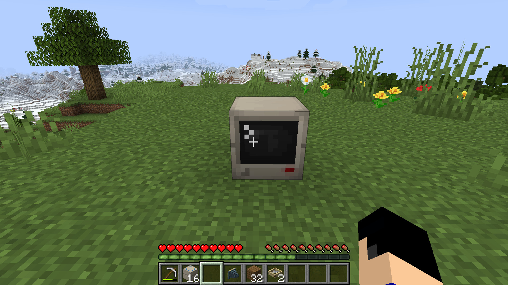
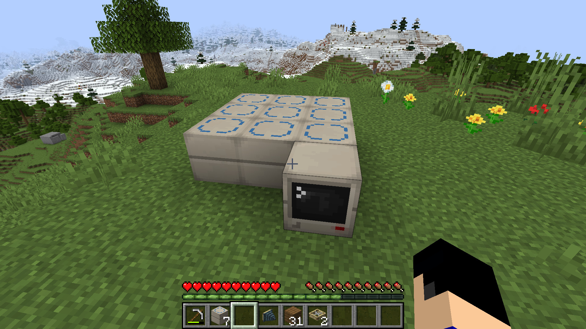
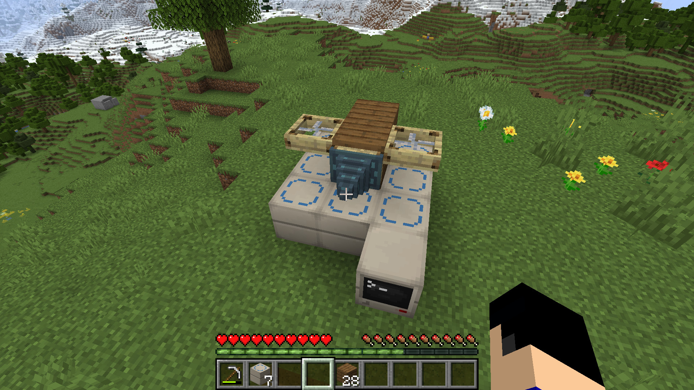
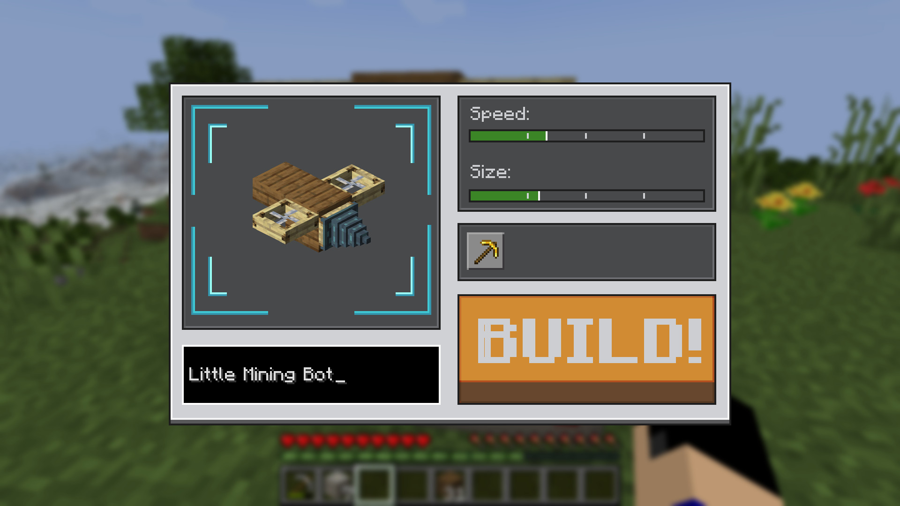
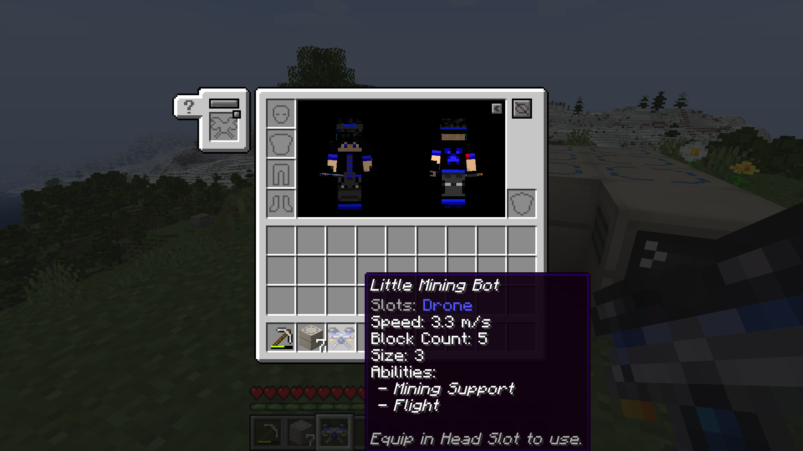
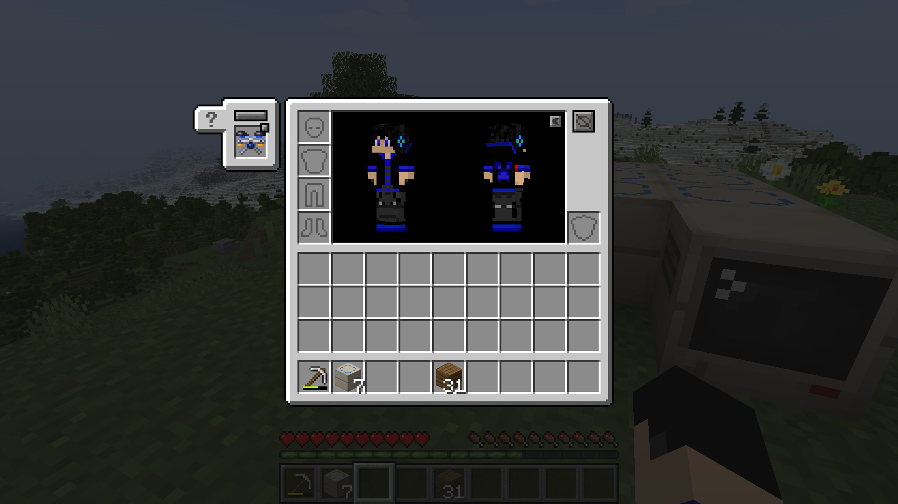
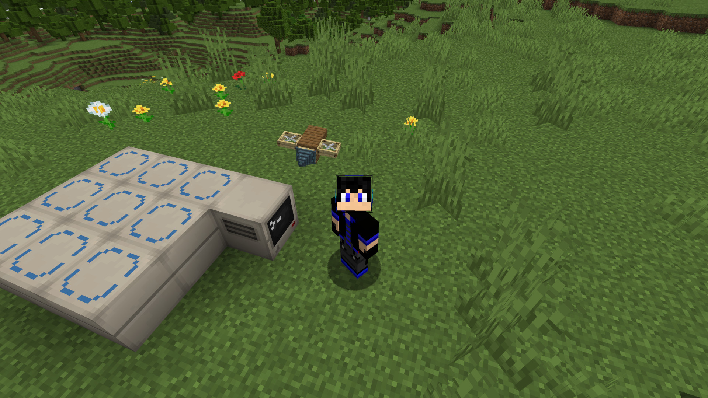

[← Back to home](index.html)

# Getting Started

This guide walks through building and equipping your first drone.

## 1. Place the Drone Assembly Controller

Place a **Drone Assembly Controller** block. When placed, it faces toward you — this facing determines which side of
your finished drone will be the "front" (the side abilities like the arrow launcher or melee attack will fire from).

## 2. Build the assembly platform

Place **Assembly Frame** blocks next to the controller to form a platform. The frame blocks can be placed in any
orientation and any connected arrangement — the controller will detect the whole connected platform automatically.

> **Tip:** The platform doesn't actually have to be square; all the frame blocks just have to be connected to a
controller or other frames. This can be useful for making oddly shaped drones on a budget.

## 3. Build your drone

On top of the frame blocks, build the shape of your drone out of whatever blocks you like. A drone can be made of up
to 1000 blocks, of any type. At minimum you'll want one of the rotor blocks (Wooden Rotor, Advanced Rotor, or Ion Thruster)
so your drone can fly — see the [Abilities Reference](abilities.html) for rotor details and other useful blocks. Any block
that is going to be part of your drone needs to have an Assembly Frame somewhere below it.

## 4. Assemble it

Right-click the controller to open its UI. This shows useful stats about your build, such as weight and flight power.
When you're happy with your design, click **BUILD!** The drone in the world is converted into a **Pocket Drone**
item, which drops for you to pick up.

> **Tip:** before you click Build, give your drone a name in the controller UI! It's about to become your faithful
> little companion, so it deserves a proper one.

## 5. Equip your drone

If you have **Curios** (NeoForge) or **Trinkets** (Fabric) installed, equip the Pocket Drone in the dedicated Drone
slot it adds. Otherwise, wear it in your helmet slot to activate it.

<table>
<tr>
<td></td>
<td></td>
</tr></table>

Once equipped, the drone is always active — there's no fuel or activation step. It'll hover near you and use
whatever abilities its blocks give it.

## 6. Editing your drone later

To make changes, place the Pocket Drone item on a controller with an attached frame (it doesn't need to be the exact
same platform or position as before — the controller will find space for it automatically). This converts it back
into real blocks so you can edit it, then assemble it again.

## What's next?

Check out the **[Abilities Reference](abilities.html)** to see what each block does and where it needs to go on your
drone.

<link rel="stylesheet" href="assets/css/lightbox3.css">
